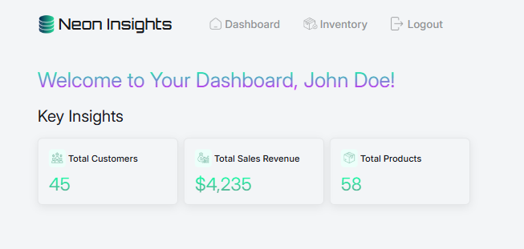
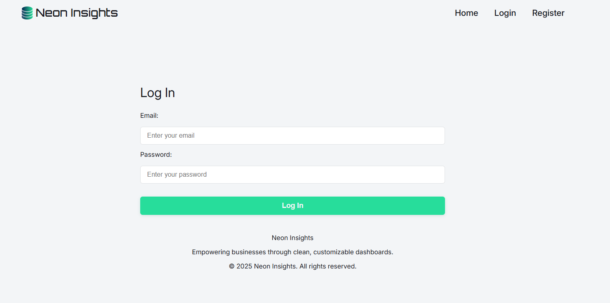

# 🚀 Neon Insights
Neon Insights is a full-stack web application for business analytics, customer management, and sales insights. It provides a modern dashboard for tracking customers, products, and sales, with secure authentication and a user-friendly interface.

---

## 📸 Screenshots


<!-- Add more screenshots as needed -->

---

## ✨ Features
- User registration with email confirmation
- Secure login and JWT authentication
- Dashboard with customer, product, and sales insights
- Responsive and modern UI
- Toast notifications for user feedback
- Modular codebase with clear separation of concerns

---

## 🛠 Tech Stack
**Front End:**  React, React Router, CSS Modules

**Back End:**  Node.js, Express.js

**Database:**  PostgreSQL

**Other:**  Nodemailer, JWT, dotenv, Toastify

---

## 📂 Project Structure
```
root/
│── neoninsights-frontend/
│   ├── public/
│   └── src/
│       ├── api/
│       ├── assets/
│       ├── components/
│       ├── hooks/
│       ├── pages/
│       ├── styles/
│       └── index.js
│── neoninsights-backend/
│   ├── controllers/
│   ├── database/
│   ├── middleware/
│   ├── models/
│   ├── routes/
│   ├── services/
│   └── index.js
│── README.md
```

---

## ⚙️ Installation & Setup
1. Clone the repo:
	 ```sh
	 git clone https://github.com/CloneMalone/Neon-Insights.git
	 cd Neon-Insights
	 ```
2. Install dependencies for both frontend and backend:
	 ```sh
	 cd neoninsights-backend
	 npm install
	 cd neoninsights-frontend
	 npm install
	 ```
3. Configure environment variables:
	 - Copy `.env.example` to `.env` in both frontend and backend folders and fill in the required values (API URLs, DB credentials, etc).
4. Run the project:
	 - Start backend:
		 ```sh
		 cd neoninsights-backend
		 npm run dev
		 ```
	 - Start frontend:
		 ```sh
		 cd neoninsights-frontend
		 npm start
		 ```

---

## 📊 Usage Examples
**Register a new user:**
```js
fetch('http://localhost:5000/api/auth/register', {
	method: 'POST',
	headers: { 'Content-Type': 'application/json' },
	body: JSON.stringify({ firstname, lastname, email, password })
});
```

**Confirm email:**
Click the link sent to your email to confirm your account.

**Login:**
```js
fetch('http://localhost:5000/api/auth/login', {
	method: 'POST',
	headers: { 'Content-Type': 'application/json' },
	body: JSON.stringify({ email, password })
});
```

---

## 🧠 Lessons Learned
- Handling async flows for email confirmation and authentication
- Structuring a scalable full-stack project
- Managing environment variables securely

---

## 🚀 Future Improvements
- [ ] Add sales, customer, and product data

---

## 📜 License
This project is licensed under the MIT License. See the LICENSE file for details.
